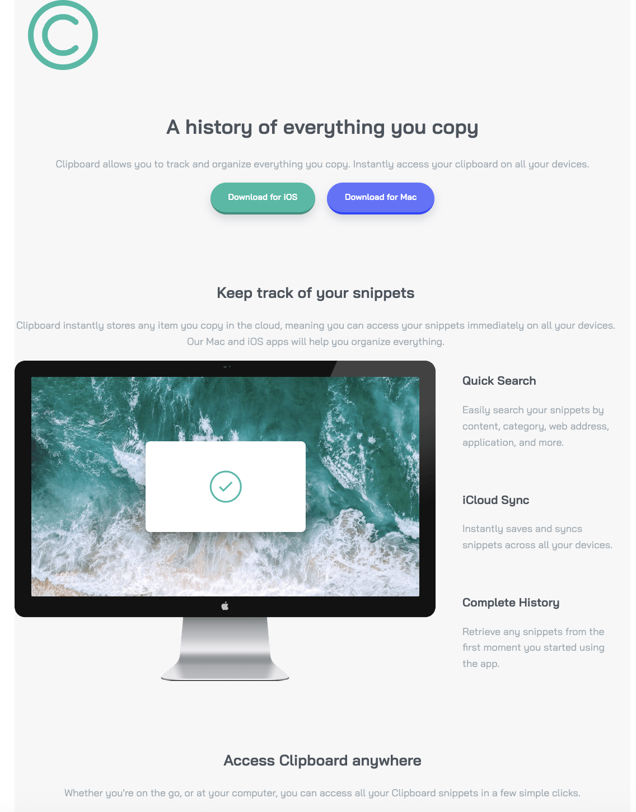
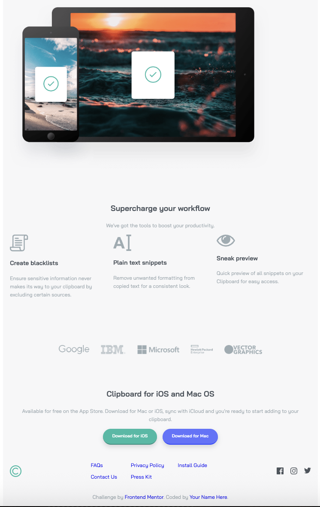

# Frontend Mentor - Clipboard landing page solution

This is a solution to the [Clipboard landing page challenge on Frontend Mentor](https://www.frontendmentor.io/challenges/clipboard-landing-page-5cc9bccd6c4c91111378ecb9). Frontend Mentor challenges help you improve your coding skills by building realistic projects.

## Table of contents

- [Overview](#overview)
  - [The challenge](#the-challenge)
  - [Screenshot](#screenshot)
  - [Links](#links)
- [My process](#my-process)
  - [Built with](#built-with)
  - [What I learned](#what-i-learned)
  - [Continued development](#continued-development)
- [Author](#author)

## Overview

### The challenge

Users should be able to:

- View the optimal layout for the site depending on their device's screen size
- See hover states for all interactive elements on the page

### Screenshot

### Links

- Solution URL: [GitHub Repository](https://github.com/yarenekenel/Clipboard-Landing-Page)
- Live Site URL: [Live Site](https://yarenekenel.github.io/Clipboard-Landing-Page/)

## My process

### Built with

- Semantic HTML5 markup
- CSS custom properties
- Flexbox
- CSS Grid
- Responsive design

### What I learned

This was a larger project than my previous ones, with multiple sections like a hero, features, a logo list and a footer. I practiced organizing a full landing page with semantic sections and consistent class names, and making each section responsive.

### Continued development

In future projects, I want to improve my skills in accessibility and in building larger, multi-section pages more efficiently.

## Author

- GitHub - [@yarenekenel](https://github.com/yarenekenel)
